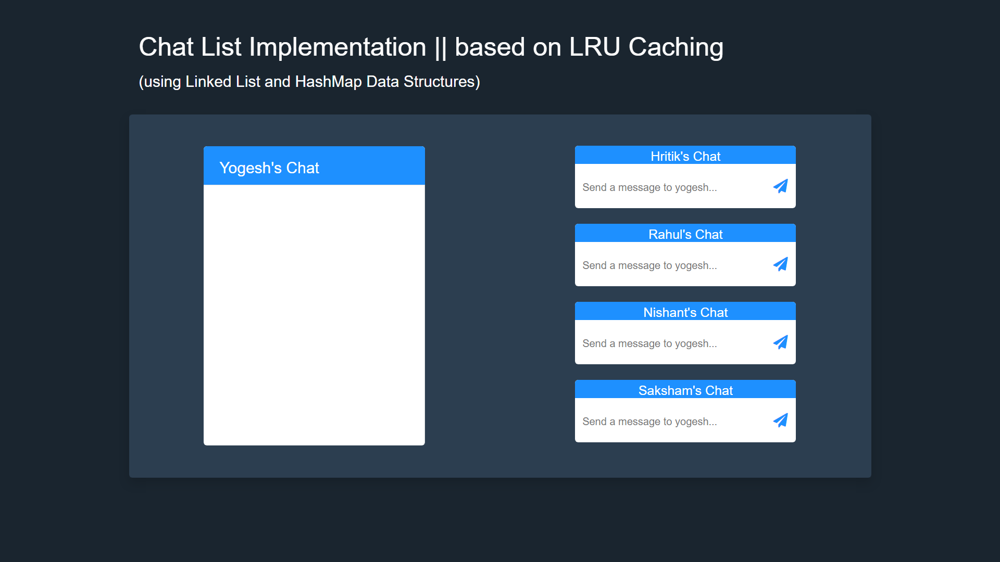

# ChatList

- Chat list application using Least Recently Used (LRU) Cache class. 
- Used Linked list and HashMap Data structures to develop the caching system. 
- Inserted and retrieved key-value pairs from the chat list in constant time. 
- The most recently used (inserted or retrieved) key-pair value can also be accessed in O(1) time.

**Note:**
Most of the functionality (like typing or deleting messages) has not been implemented **yet**.
